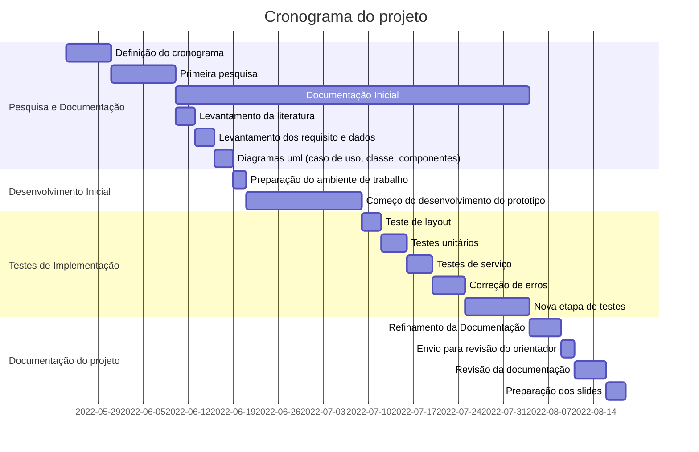

# Automação de tarefas no envio de mensagens

### Descrição:
Com esse projeto, pretendemos mostrar nosso avanço e conhecimento nas áreas de Desenvolvimento para dispositivos móveis e Testes de Software.

### Lista sequencial das atividades:

- Pesquisa e Documentação
- Desenvolvimento inicial
- Teste de implementação
- Documentação do projeto

### Cronograma:

### Descrição dos grupos das atividades e das atividades:
#### **Pesquisa e Documentação:**
- Aqui é onde iniciaremos a pesquisa e definição das etapas do processo, sera uma etapa com bastante pesquisa.
- Inicia-se também a documentação do projeto, que continuará até o final da etapa de Testes de Implementação.

#### **Desenvolvimento inicial:**
- Com as pesquisas e diagramas prontos, iniciaremos a contrução de um protótipo.

#### **Teste de implementação:**
- Com o prototipo já em mãos, iniciaremos uma etapa de testes, para encontrar e corrigir possíveis erros.

#### **Documentação do projeto**
- Após todo esse período, finalizariamos a documentação do relatório.
- Preparariamos também os slides e a contrução da defesa do projeto.

---

## Imagens das telas

### Telas iniciais

### Telas de gerenciamento

### Telas contatos

### Telas configurações

Na parte inicial apresenta a foto do usuário, com as opções de alterar foto, visualização de cadastro, central de ajuda e apagar conta.

Na visualização de cadastro, o usuário consegue ver seus dados vinculados a aplicação, dando a opção de fazer edições do nome, telefone e email, sendo que estes devem seguir o padrão de preenchimento, ao finalizar a visualização/edição, tem a opção de salvar ou voltar, para caso não deseje realizar a alteração e ao clicar em salvar, as informações devem imediatamente ser apresentada ao usuário na mesma tela que faz a edição.

Na opção de alterar foto, torna-se um campo optativo de inserir ou não a foto, ao clicar em escolher, deve ser direcionado ao diretório do dispositivo para buscar a foto desejada, caso não deseje fazer a alteração é só clicar em voltar, que retornará a tela de configuração.

Na opção de apagar conta, faz a pergunta se realmente deseje apagar a conta, se confirmar, o aplicativo deve direcionar o usuário a tela de cadastro, caso clicar em não, deve retornar a tela de configuração.

A opção de central de ajuda, traz informações acerca do aplicativo, em relação ao conceito e uso.

