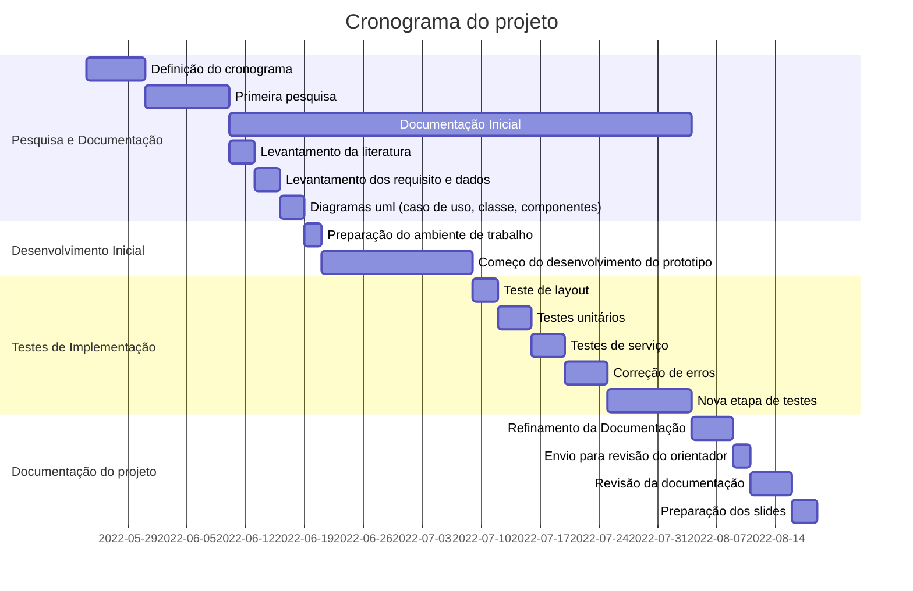

# Automação de tarefas no envio de mensagens

### Descrição:
Com esse projeto, pretendemos mostrar nosso avanço e conhecimento nas áreas de Desenvolvimento para dispositivos móveis e Testes de Software.

### Lista sequencial das atividades:

- Pesquisa e Documentação
- Desenvolvimento inicial
- Teste de implementação
- Documentação do projeto

### Cronograma:

### Descrição dos grupos das atividades e das atividades:
#### **Pesquisa e Documentação:**
- Aqui é onde iniciaremos a pesquisa e definição das etapas do processo, sera uma etapa com bastante pesquisa.
- Inicia-se também a documentação do projeto, que continuará até o final da etapa de [Testes de Implementação](https://github.com/HetrisleyGomes/PI#teste-de-implementa%C3%A7%C3%A3o).

#### **Desenvolvimento inicial:**
- Com as pesquisas e diagramas prontos, iniciaremos a contrução de um protótipo.

#### **Teste de implementação:**
- Com o prototipo já em mãos, iniciaremos uma etapa de testes, para encontrar e corrigir possíveis erros.

#### **Documentação do projeto**
- Após todo esse período, finalizariamos a documentação do relatório.
- Preparariamos também os slides e a contrução da defesa do projeto.

