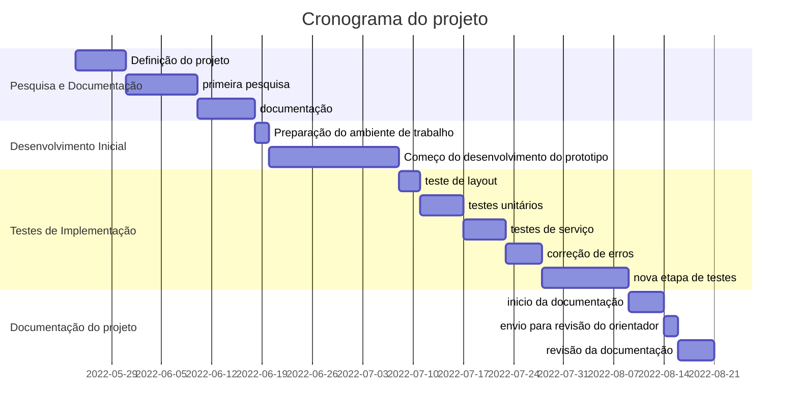

# Anotações do Projeto Integrador

----

exemplo:

```mermaid
gantt
title Cronograma do projeto
dateFormat DD-MM-YYYY
section Pesquisa e Documentação
 Definição do projeto     :a1, 24-05-2022, 7d
 primeira pesquisa        :a2, after a1, 10d
 documentação             :a3, after a2, 8d

section Desenvolvimento Inicial
  Preparação do ambiente de trabalho      :a4, after a3, 2d
  Começo do desenvolvimento do prototipo  :a5, after a4, 18d

section Testes de Implementação
  teste de layout     :3d
  testes unitários    :6d
  testes de serviço   :6d
  correção de erros   :5d
  nova etapa de testes:12d
  
section Documentação do projeto
  inicio da documentação           :5d
  envio para revisão do orientador :2d
  revisão da documentação          :5d

```
